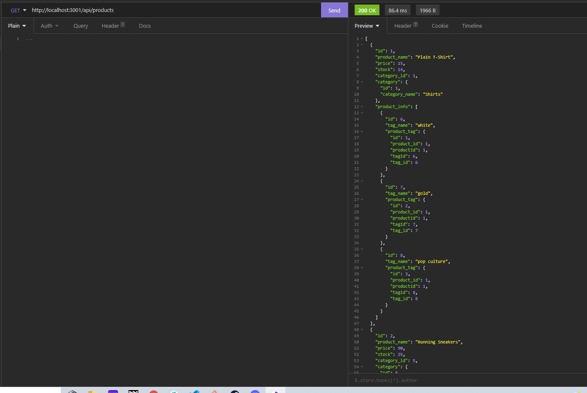

​#E-Commerce Backend Application
## Table of contents
​
- [General info](#General-Info)
- [Technologies](#Technologies)
- [Containers](#Containers)
- [Deployment](#Deployment)
- [Code Overview](#Code-Overview)
- [Video Demo and Instructions](#Video-Demo-and-Instructions)
-
​
​
## General-Info

This project is a base level database with interactions for veiwing, updating, and deleting products and categories based on ID numbers.  Most of the code was provided by instructors but the routes and models were built out to specifications to allow these interactions. 
​
This project utilizes a full MERN stack in order to CRUD data and display it realtime on visualizations. 
- Node.js
- MySql2
- Insomnia(as used in istructional video to show case routes)
- Express
​
​
## Deployment
​
Download the repository

- https://github.com/ghmurphy2/ecommerce-backend
​
​
## Video Demo and Instructions

Be sure to install all required modules before running and follow along with the video for proper use and order of operations. 
### Setup and Installation Video
https://watch.screencastify.com/v/HXMfLbk8x0ogTanYBR7r

### Use and Utility
https://watch.screencastify.com/v/grx4OLyDSUfvDIczLhi2
​
​
## Authors
​
- Gavin Murphy
​
## License
​
- Open Source
